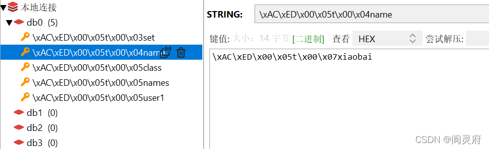

# springboot_redis【spring-boot-starter-data-redis】

Redis支持五种数据类型：string（字符串），hash（哈希），list（列表），set（集合）及zset(sorted set：有序集合)。

## 1. Redisson，Jedis，Lettuce 三者的区别
首先 Redis 对 Java 常用的 client 有 Redisson，Jedis，Lettuce 三种。其中Jedis即将被淘汰了。   
共同点：都提供了基于Redis操作的Java API，只是封装程度，具体实现稍有不同。RedisTemplate封装了Jedis和Lettuce，RedissonTemplate封装了Redisson，这两个类都在 spring-boot-starter-data-redis start中  
不同点：
1. Jedis
    + Jedis在实现上是直接连接的redis server
    + 使用阻塞的I/O，方法调用同步，程序流需要等到socket处理完I/O才能执行，不支持异步操作。
    + Jedis客户端实例不是线程安全的，需要通过连接池来使用Jedis，为每个Jedis实例增加物理连接。
2. Redisson
    + 优点点：分布式锁，分布式集合，可通过Redis支持延迟队列。
    + Redisson实现了分布式和可扩展的Java数据结构，和Jedis相比，功能较为简单，不支持字符串操作，不支持排序、事务、管道、分区等Redis特性。
    + Redisson的宗旨是促进使用者对Redis的关注分离，从而让使用者能够将精力更集中地放在处理业务逻辑上。
3. Lettuce
    + Lettuce的连接是基于Netty的，连接实例（StatefulRedisConnection）可以在多个线程间并发访问， 因为 StatefulRedisConnection
      是线程安全的，所以一个连接实例（StatefulRedisConnection）就可以满足多线程环境下的并发访问， 当然这个也是可伸缩的设计，一个连接实例不够的情况也可以按需增加连接实例。
    + 用于线程安全同步，异步和响应使用，支持集群，Sentinel，管道和编码器。
    + 基于Netty框架的事件驱动的通信层，其方法调用是异步的。
    + Lettuce 当多线程使用同一连接实例时，是线程安全的，所以可以操作单个Lettuce连接来完成各种操作。  
*注意*：优先使用Lettuce，如果需要分布式锁，分布式集合等分布式的高级特性，添加Redisson结合使用，因为Redisson本身对字符串的操作支持很差。

## 2. RedisTemplate 基础认识
RedisTemplate 是基于某个具体实现的再封装，比如说 springBoot1.x 时，具体实现是 jedis；而到了springBoot2.x 时，具体实现变成了 lettuce。

### 2.1 基础了解
1. 引入jar包
    ```xml
        <!-- RedisTemplate jar包 -->
        <dependency>
            <groupId>org.springframework.boot</groupId>
            <artifactId>spring-boot-starter-data-redis</artifactId>
        </dependency>
    ```
2. 连接池自动管理，提供了一个高度封装的 RedisTemplate 类
3. 将同一类型操作封装为operation接口：
    + ValueOperations：*简单K-V操作(字符串)*
     ```text
        // 示例：
        ValueOperations ops = RedisTemplate.opsForValue();
        ops.set("StringKey", "StringVaule");
    ```
    + ListOperations：*针对list类型的数据操作*
    + SetOperations：*set类型数据操作*
    + ZSetOperations：*zset类型数据操作*
    + HashOperations：*针对map类型的数据操作*
    + StreamOperations：*Stream是Redis 5.0引入的一种新数据类型，它以更抽象的方式模拟日志数据结构，但日志的本质仍然完好无损*
    + GeoOperations：*地理位置信息*
    + HyperLogLogOperations：*HyperLogLog是用来做基数统计的算法*
    + ClusterOperations：*cluster集群*
4. 提供了对key的 bound(绑定)便捷化操作API，可以通过bound封装指定的key，然后进行一系列的操作而无须“显式”的再次指定Key，即 BoundKeyOperations：
    + BoundValueOperations
   ```text
        // 示例：  
        BoundValueOperations stringKey = RedisTemplate.boundValueOps("StringKey");  
        stringKey.set("StringVaule");
    ```
    + BoundListOperations
    + BoundSetOperations
    + BoundZSetOperations
    + BoundHashOperations
5. 将事务封装，由容器进行控制
6. 针对数据的“序列化/反序列化”，提供了多种可选择序列化策略(RedisSerializer)
    ```text
        // spring-boot-starter-data-redis start中提供的类
        class RedisAutoConfiguration { 
            @Bean
            @ConditionalOnMissingBean (
                name = {"redisTemplate"}
            )
            public RedisTemplate<Object, Object> redisTemplate(RedisConnectionFactory redisConnectionFactory) throws UnknownHostException {
               // 这里通过创建RedisTemplate对象来操作redis，进入对象内部我们可以看到如下代码
                RedisTemplate<Object, Object> template = new RedisTemplate();
                template.setConnectionFactory(redisConnectionFactory);
                return template;
            }
        }
        
        class RedisTemplate {
            /*
             * (non-Javadoc)
             * @see org.springframework.data.redis.core.RedisAccessor#afterPropertiesSet()
             */
            @Override
            public void afterPropertiesSet() {
                super.afterPropertiesSet();
                boolean defaultUsed = false;
                if (defaultSerializer == null) {
                    // 默认装配了 JDK 的序列化方式
                    defaultSerializer = new JdkSerializationRedisSerializer(
					classLoader != null ? classLoader : this.getClass().getClassLoader());
                }
                if (enableDefaultSerializer) {
                    if (keySerializer == null) {
                        keySerializer = defaultSerializer;
                        defaultUsed = true;
                    }
                    if (valueSerializer == null) {
                        valueSerializer = defaultSerializer;
                        defaultUsed = true;
                    }
                    if (hashKeySerializer == null) {
                        hashKeySerializer = defaultSerializer;
                        defaultUsed = true;
                    }
                    if (hashValueSerializer == null) {
                        hashValueSerializer = defaultSerializer;
                        defaultUsed = true;
                    }
                }
                if (enableDefaultSerializer && defaultUsed) {
                    Assert.notNull(defaultSerializer, "default serializer null and not all serializers initialized");
                }
                if (scriptExecutor == null) {
                    this.scriptExecutor = new DefaultScriptExecutor<>(this);
                }
                initialized = true;
            }
        }
    ```
    所以，如果我们不自定义序列化机制的话，RedisTemplate就默认使用JDK序列化。这样在redis中我们很难看清楚数据的样子，因为都是一些序列化后的乱码。在这里想要看清对象原本的模样，有两种解决办法：
   1. 在存对象之前，把对象转为JSON格式。在取的时候，需要将JSON再转为对像。
   2. 自定义序列化机制。示例代码：[RedisTemplateConfig.java: Line 23](src/main/java/com/example/redistemplate/config/RedisTemplateConfig.java#L23)
        + *JdkSerializationRedisSerializer*：RedisTemplate默认使用。POJO对象的存取场景，使用JDK本身序列化机制，将pojo类通过ObjectInputStream/ObjectOutputStream进行序列化操作，最终redis-server中将存储字节序列。是目前最常用的序列化策略。
        
           + 缺点：可读性差；内存占用较大
        + *StringRedisSerializer*：Key或者value为字符串的场景，根据指定的charset对数据的字节序列编码成string，是“new String(bytes, charset)”和“string.getBytes(charset)”的直接封装。是最轻量级和高效的策略。
        + *JacksonJsonRedisSerializer*：jackson-json工具提供了javabean与json之间的转换能力，可以将pojo实例序列化成json格式存储在redis中，也可以将json格式的数据转换成pojo实例。因为jackson工具在序列化和反序列化时，需要明确指定Class类型，因此此策略封装起来稍微复杂。【需要jackson-mapper-asl工具支持】

### 2.2 具体使用
1. 建议使用泛型的方式。在使用中就不会涉及到类型的强制转换。例：RedisTemplate<String, String> RedisTemplateString;
2. 使用自定义的类型作为泛型的异常情况
   + redis 自动注入时，泛型只能有两种
     + ：RedisTemplate<Object, Object>
     + ：StringRedisTemplate extends RedisTemplate<String, String>
   + 如果项目中使用的泛型不是这两种，可以在导入的时候不指明泛型，否则自动导入会报错:
   ```text
       Description:  
       A component required a bean of type 'org.springframework.data.redis.core.RedisTemplate' that could not be found.  
       Action:  
       Consider defining a bean of type 'org.springframework.data.redis.core.RedisTemplate' in your configuration.
   ```
   + 可以改为不使用泛型的 RedisTemplate 或者是重新配置【如果针对自动配置类型添加自己的Bean(例如：RedisTemplateConfig)，它将取代默认的】
3. RedisTemplate 使用时常见问题：  
   RedisTemplate 中存取数据都是字节数组。当 Redis 中存入的数据是可读形式而非字节数组时，使用 RedisTemplate 取值的时候会无法获取导出数据，获得的值为null。可以使用 StringRedisTemplate 试试。
4. Redis中value时数字并且要对数据进行计算的时候，有 RedisTemplate 和 StringRedisTemplate 两种模板，RedisTemplate 模板使用时应为默认使用了JDK的序列化 会在递增/递减的过程中出现问题，stringRedisTemplate不会。
   + RedisTemplate源码中，其默认的序列化器为JdkSerializationRedisSerializer：在序列化器进行序列化的时候，将key对应的value序列化为了字符串。使用的jdk对象序列化，序列化后的值有类信息、版本号等，所以是一个包含很多字母的字符串，所以根本无法加1。
   + GenericJackson2JsonRedisSerializer、Jackson2JsonRedisSerializer：在序列化器进行序列化的时候，是先将对象转为json，然后再保存到redis，所以，1在redis中是字符串1，所以无法进行加1，最后的结果只能是拼接字符串操作。
   + GenericToStringSerializer、StringRedisSerializer：将字符串的值直接转为字节数组，所以保存到redis中是数字，所以可以进行加1
5. Redis 缓存管理器。  
    当我们引入redis后，缓存管理器就有默认的ConcurrentMapCacheManager 变成RedisCacheManager，序列化方式会变成默认的jdk。  
    设置方式示例：[RedisTemplateConfig.java: Lines 161-183](src/main/java/com/example/redistemplate/config/RedisTemplateConfig.java#L161-L183)

### 2.3 lettuce 作为客户端在并发情况下的对内存溢出情况
    在高并发情况下使用上文的操作可能会导致OutOfDirectMemoryError（堆外内存溢出异常！）
+ 产生异常的原因：
    springboot2.0以后的redisTemplate默认使用lettuce作为操作redis的客户端（点进spring-boot-starter-data-redis即可看到）
    底层使用netty进行网络通讯，所以他的吞吐量非常大，但是由于lettuce本身存在bug，在高并发情况下，不能及时释放掉内存，所以会导致netty堆外内存溢出
    netty如果没有指定堆外内存，默认使用 -Xmx300m作为堆外内存，这个值变大，可延缓出现 OutOfDirectMemoryError 的时机，但并不是解决办法！

+ 解决方案：
    1. 修改lettuce源码，升级客户端，解决其存在的bug
    2. 使用jedis客户端
    ```xml
        <!-- 引入redis依赖，但由于lettcue本身存在bug，所以排除掉lettcue客户端，使用jedis作为客户端 -->
        <dependency>
            <groupId>org.springframework.boot</groupId>
            <artifactId>spring-boot-starter-data-redis</artifactId>
            <exclusions>
                <exclusion>
                    <groupId>io.lettuce</groupId>
                    <artifactId>lettuce-core</artifactId>
                </exclusion>
            </exclusions>
        </dependency>
        <!-- 引入操作redis的客户端jedis -->
        <dependency>
            <groupId>redis.clients</groupId>
            <artifactId>jedis</artifactId>
        </dependency>
    ```
### 2.4 Luttuce 长时间不操作超时问题
    在开发的时候，使用到Lettuce连接redis，一段时间后不操作，再去操作redis，会报连接超时错误，在其重连后又可使用。
    原因是：Lettuce 自适应拓扑刷新（Adaptive updates）与定时拓扑刷新（Periodic updates） 是默认关闭的导致问题的出现
1. SpringBoot2.3.x后，可使用配置文件中开启lettuce的拓扑刷新
    ```yaml
    lettuce:
      pool:
        max-active: 20
        max-wait: -1ms
        max-idle: 10
        min-idle: 2
      cluster:
        refresh:
          adaptive: true
          #20秒自动刷新一次
          period: 20
   ```
2. 使用jedis客户端
    引入 Jedis 包，并在配置文件中配置
    ```yaml
    spring:
      redis:
        password: xxx
        host: 172.16.0.x
        port: 6579
        timeout: 5000
        jedis:
          pool:
                  #最大连接数据库连接数,设 0 为没有限制
            max-active: 8
                  #最大等待连接中的数量,设 0 为没有限制
            max-idle: 8
                  #最大建立连接等待时间。如果超过此时间将接到异常。设为-1表示无限制。
            max-wait: -1ms
                  #最小等待连接中的数量,设 0 为没有限制
            min-idle: 0
        #lettuce:
          #pool:
            #max-active: ${redis.config.maxTotal:1024}
            #max-idle: ${redis.config.maxIdle:50}
            #min-idle: ${redis.config.minIdle:1}
            #max-wait: ${redis.config.maxWaitMillis:5000}
   ```

## 3. StringRedisTemplate  
    StringRedisTemplate 和 RedisTemplate 两者的数据是不共通的；也就是说 StringRedisTemplate 只能管理 StringRedisTemplate 里面的数据，RedisTemplate 只能管理 RedisTemplate 中的数据。  
+ 其实他们两者之间的区别主要在于他们使用的序列化类:  
   + RedisTemplate 默认使用的是 JdkSerializationRedisSerializer  
   + StringRedisTemplate 默认使用的是 StringRedisSerializer  

+ 使用时注意事项：  
   + 当你的redis数据库里面本来存的是字符串数据或者你要存取的数据就是字符串类型数据的时候，那么你就使用StringRedisTemplate即可。  
   + 但是如果你的数据是复杂的对象类型，而取出的时候又不想做任何的数据转换，直接从Redis里面取出一个对象，那么使用RedisTemplate是更好的选择。

+ RedisTemplate 和 StringRedisTemplate 的区别和联系：
   + StringRedisTemplate和RedisTemplate，这两个类是 spring-boot-starter-data-redis 对 Redis 进行操作的实现类。
   + 第一点，StringRedisTemplate 继承了 RedisTemplate。  
   + 第二点，一般来说子类应该比父类有用更强大的功能，而此处却不是。因为 RedisTemplate 是泛型类，而在 StringRedisTemplate 继承 RedisTemplate 类时，则是指定了泛型的类型，两个String。
   + 第三点，StringRedisTemplate 只能对 key=String，value=String 的键值对进行操作，RedisTemplate 可以对任何类型的 key-value 键值对操作。  
   + 第四点，是他们各自序列化的方式不同，但最终都是得到了一个字节数组，殊途同归。StringRedisTemplate 使用的是 StringRedisSerializer 类；RedisTemplate 使用的是 JdkSerializationRedisSerializer 类。反序列化，则是一个得到String，一个得到Object

+ StringRedisTemplate 在使用中报错的问题：
   ```text
       遇到的报错【springboot版本2.3.3.RELEASE的时候报错，升级到版本2.4.5就不会报错了。报错解决办法 pom.xml 中加 commons-pool2 包】
       Caused by: java.lang.ClassNotFoundException: org.apache.commons.pool2.impl.GenericObjectPoolConfig
           at java.net.URLClassLoader.findClass(URLClassLoader.java:381) ~[na:1.8.0_181]
           at java.lang.ClassLoader.loadClass(ClassLoader.java:424) ~[na:1.8.0_181]
           at sun.misc.Launcher$AppClassLoader.loadClass(Launcher.java:349) ~[na:1.8.0_181]
           at java.lang.ClassLoader.loadClass(ClassLoader.java:357) ~[na:1.8.0_181]
           ... 60 common frames omitted
   ```

## 4. RedisTemplate 和 StringRedisTemplate 两者的关系

    ```text
       这两者都是来自于 RedisAutoConfiguration 类，这个类自动生成了这两个对象
       public class RedisAutoConfiguration {
            public RedisAutoConfiguration() {
            }
        
            // RedisAutoConfiguration为我们做了两件事情
            // 1.注册RedisTemplate对象（k-v 都是对象）
            // 2.注册stringRedisTemplate对象（k-v 都是字符串）  如下代码所示：
            //    因为帮我们自动向容器中注册了xxxTemplate，所以我们可以直接使用xxxTemplate来操作redis
            @Bean
            @ConditionalOnMissingBean(
                name = {"redisTemplate"}
            )
            public RedisTemplate<Object, Object> redisTemplate(RedisConnectionFactory redisConnectionFactory) throws UnknownHostException {
                RedisTemplate<Object, Object> template = new RedisTemplate();
                template.setConnectionFactory(redisConnectionFactory);
                return template;
            }
        
            @Bean
            @ConditionalOnMissingBean
            public StringRedisTemplate stringRedisTemplate(RedisConnectionFactory redisConnectionFactory) throws UnknownHostException {
                StringRedisTemplate template = new StringRedisTemplate();
                template.setConnectionFactory(redisConnectionFactory);
                return template;
            }
        }
    ```


## 五. Redis 缓存注解的使用
+ Cache 缓存接口，定义缓存的操作。实现有：RedisCache，EhCacheCache，ConcurrentMapCache
+ CacheManager  缓存管理器，管理各种缓存组件
+ @Cacheable      主要针对方法配置，能根据方法的请求参数对其返回结果进行缓存
+ @CachePut       保证方法被调用，又希望结果被缓存。与@Cacheable区别在于是否每次都调用方法。常用于更新
+ @CacheEvict     清空缓存
+ @EnableCaching  开启基于注解的缓存
+ @CacheConfig    同意配置类的缓存注解属性
+ keyGenerator    缓存数据是，key的生成策略
+ serialize       缓存数据时，value的序列化策略  
详细见 有道云笔记p6 Redis缓存注解

## 六. spring-data-redis连接池

连接池使用原因：  
   + 在某些业务场景中使用了redis作为分布式缓存，在做业务活动的时候，比如秒杀活动，会一时间涌入大量的流量，这个时候和redis server进行网络连接的话就比较耗费资源和时间，直接影响接口的响应时间。  

针对这种某一时刻的突发性流量，使用连接池是比较合适的。  
ps:spring-boot-starter-redis默认是不使用连接池的
### 6.1 连接池
+ SpringBoot 1.x 默认采用 Jedis 作为 redis 客户端连接池
+ SpringBoot 2.x spring-data-redis 默认采用 Lettuce 作为 redis 客户端驱动连接池

从 spring-boot-starter-redis 1.4.7.RELEASE是默认使用jedis连接池的最后一个版本

在 springboot1.4.7 之前的版本配置客户端连接池如下：
```yaml
spring:
  redis:
    pool:
      maxActive: 5000
      maxIdle: 30
      minIdle: 5
      max-wait: 2000
```
在1.4.7之后同时支持了jedis和lettuce两种连接池，配置方式也有点不同：
```yaml
spring:
  redis:
    jedis:        # jedis连接池配置
      pool:
        maxActive: 5000				#最大连接数量
        maxIdle: 30					#最大闲置数量
        minIdle: 5					#最小闲置数量
        max-wait: 2000				#从连接池中获取连接的最大等待时间

    lettuce:      # lettuce链接配置
      pool:
        maxActive: 5000					#最大连接数
        maxIdle: 30						#连接池最大空闲连接数.
        minIdle: 5						#连接池最小空闲连接数.
        max-wait: 2000					#从连接池中获取连接时的最大等待时间
        time-between-eviction-runs: 60s	#空闲对象逐出器线程的运行间隔时间.空闲连接线程释放周期时间.
```
### 6.2 Lettuce连接池的问题
SpringBoot2.x开始默认使用的Redis客户端由Jedis变成了Lettuce，但是当Redis集群中某个节点挂掉之后，Lettuce将无法继续操作Redis，原因在于此时Lettuce使用的仍然是有问题的连接信息。

Lettuce支持redis 集群拓扑动态刷新，但是默认并没有开启，SpringBoot在集成Lettuce时默认也没有开启。并且在SpringBoot2.3.0之前，是没有配置项设置Lettuce自动刷新拓扑的。
解决方案：

升级到SpringBoot2.3.0或以上版本。并添加如下配置项
```yaml
spring:
  redis:
    lettuce:
      cluster:
        refresh:
          adaptive: true		#拓扑动态感应即客户端能够根据 redis cluster 集群的变化，动态改变客户端的节点情况，完成故障转移。
          period: 60s			#刷新redis集群状态周期时间
    timeout: 60s				#连接redis的最大等待时间
```
在使用lettuce连接池时，创建连接工厂时依赖了commons-pool2,记得引入依赖
```xml
<dependency>
    <groupId>org.apache.commons</groupId>
    <artifactId>commons-pool2</artifactId>
</dependency>
```

## 六. 分布式锁 Redisson
https://github.com/redisson/redisson/wiki/Redisson%E9%A1%B9%E7%9B%AE%E4%BB%8B%E7%BB%8D
Redis分布式锁的本质：  
    Redis获取分布式锁，其实就是向N个Redis实例中使用SETNX来对该resource设置键值。  
    解锁：就是反向操作，删除掉resource的键值。
+ Redisson 中锁的种类
    + Lock
    + Fair Lock
    + MultiLock
    + RedLock
    + ReadWriteLock
    + Semaphore
    + PermitExpirableSemaphore
    + CountDownLatch

+ 分布式锁的基本原理：
1. 分布式锁本质是占一个坑，当别的进程也要来占坑时发现已经被占，就会放弃或者稍后重试
2. 占坑一般使用 setnx(set if not exists)指令，只允许一个客户端占坑
3. 先来先占，用完了在调用del指令释放坑
4. 但是这样有一个问题，如果逻辑执行到中间出现异常，可能导致del指令没有被调用，这样就会陷入死锁，锁永远无法释放
5. 为了解决死锁问题，我们拿到锁时可以加上一个expire过期时间，这样即使出现异常，当到达过期时间也会自动释放锁
6. 这样又有一个问题，setnx和expire是两条指令而不是原子指令，如果两条指令之间进程挂掉依然会出现死锁
7. 为了治理上面乱象，在redis 2.8中加入了set指令的扩展参数，使 setnx 和expire指令可以一起执行

+ 一个客户端如果要获得锁，必须经过下面的五个步骤
1. 获取当前 Unix 时间，以毫秒为单位。
2. 依次尝试从 N 个实例，使用相同的 key 和随机值获取锁。在步骤 2，当向 Redis 设置锁时，客户端应该设置一个网络连接和响应超时时间，
   这个超时时间应该小于锁的失效时间。例如你的锁自动失效时间为 10 秒，则超时时间应该在 5-50 毫秒之间。
   这样可以避免服务器端 Redis 已经挂掉的情况下，客户端还在死死地等待响应结果。如果服务器端没有在规定时间内响应，客户端应该尽快尝试另外一个 Redis 实例。
3. 客户端使用当前时间减去开始获取锁时间（步骤 1 记录的时间）就得到获取锁使用的时间。
   当且仅当从大多数（这里是 3 个节点）的 Redis 节点都取到锁，并且使用的时间小于锁失效时间时，锁才算获取成功。
4. 如果取到了锁，key 的真正有效时间等于有效时间减去获取锁所使用的时间（步骤 3 计算的结果）。
5. 如果因为某些原因，获取锁失败（没有在至少 N/2+1 个Redis实例取到锁或者取锁时间已经超过了有效时间），
   客户端应该在所有的 Redis 实例上进行解锁（即便某些 Redis 实例根本就没有加锁成功）。

看门狗
红锁和联锁：
